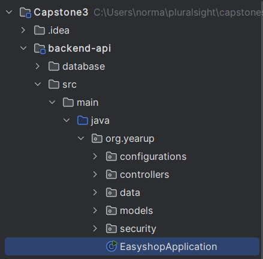
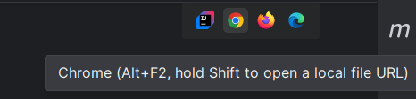
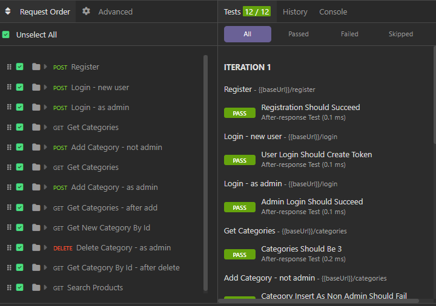
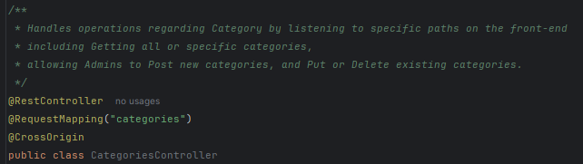
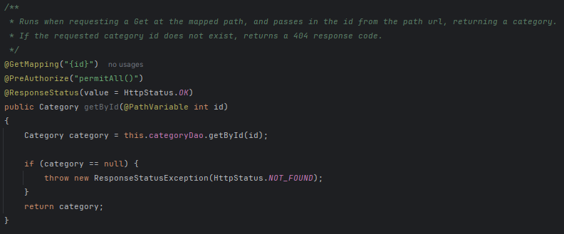
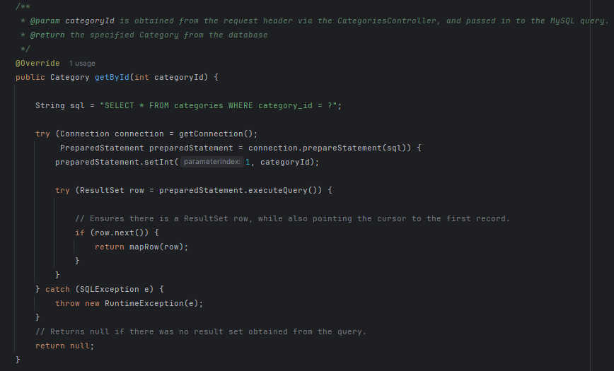

# 
Magic Video Games

## 
Overview

 

* This project contains a Java Spring Boot RESTful backend API, which provides
  authenticated access to categories, products, and user-specific shopping carts.
  All data persists within a MySQL database hosted locally.
  * The focus of this project is on backend logic, interacting with the database, and API design. 
    The frontend serves to help visualize REST endpoints, and how we use them.
 
 
## 
How to run the backend

* In the backend-api directory, navigate to src/main/java/org/yearup
  From the EasyShopApplication class, you can start the backend API.

 
 
## 
How to run the frontend

* In the frontend-ui directory, you will find index.html
  From the top right corner of that file, 
  you can open the frontend UI in a browser of your choice.
  Note: The backend API must be running.

 
 
## Key API features:
  * User login and registration
  * JSON web tokens are required for protected endpoints
  * Retrieve available categories and products straight from the database
  * Filter results based on various values, such as pricing, category, and subcategory
  * Retrieve the current user's shopping cart, and add or remove products
  * Returns appropriate HTTP response status codes for supported requests
  * Database information is stored in the application.properties file
 
 
* API endpoints were tested using Insomnia

 
 
## How it works:
* Controllers listen for requests at specific endpoints

 
* Once those specific endpoints receive a request, the controller will call a DAO to query the database

 
* The DAO will then use secure PreparedStatements to obtain the results
