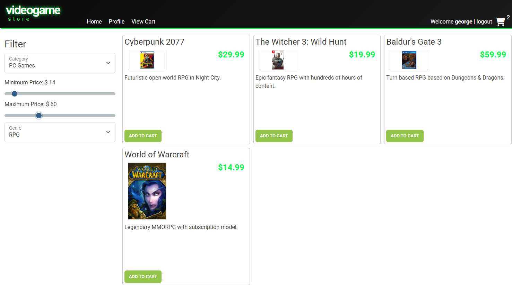

# 
Magic Video Games

## 
Overview

 

* This project contains a Java Spring Boot RESTful backend API, which provides authenticated access to categories, products, and user-specific shopping carts. All data persists within a MySQL database hosted locally.
  * The focus of this project is on backend logic, interacting with the database, and API design. The frontend serves to help visualize REST endpoints, and how we use them.
## 
How to run the backend

* In the backend-api directory, navigate to src/main/java/org/yearup
* From the EasyShopApplication class, you can start the backend API.

## 
How to run the frontend

* In the frontend-ui directory, you will find index.html. From the top right corner of that file, you can open the frontend UI in a browser of your choice. Note: The backend API must be running.

## Key API features:
  * User login and registration
  * JSON web tokens are required for protected endpoints
  * Retrieve available categories and products straight from the database
  * Filter results based on various values, such as pricing, category, and subcategory
  * Retrieve the current user's shopping cart, and add or remove products
  * Returns appropriate HTTP response status codes for supported requests
  * Database information is stored in the application.properties file
* API endpoints were tested using Insomnia

## How it works:
* Controllers listen for requests at specific endpoints

* Once those specific endpoints receive a request, the controller will call a DAO to query the database

* The DAO will then use secure PreparedStatements to obtain the results

### Example of frontend showing filtered products:
